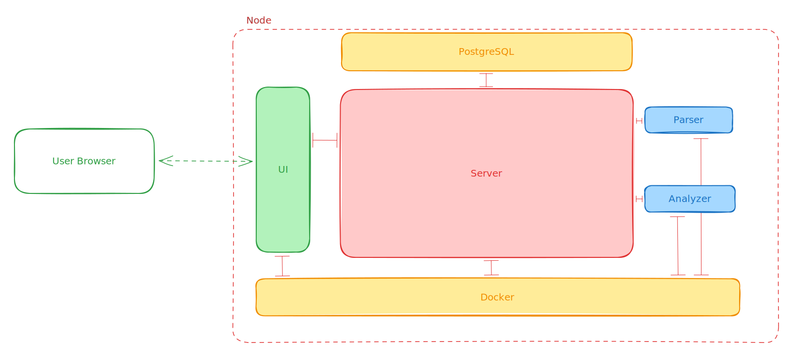

# System Overview

Guardlight is based on a modular design that can be extended and adapted to a specific need.

### Terminology

**UI** — The user interface the user interacts with

**Server** — The application that serves as the API and orchestrates analysis jobs.

**Docker** — Docker is a platform that lets you separate the application from your infrastructure into isolated, secure containers.

**Docker Image** — A Docker image contains everything needed to run a containerized application. (e.g. Python for a Analyzer worker).

**Container** — Each server will be running inside an isolated container to enforce hardware limitations (such as CPU and RAM) and avoid any interference between servers on one node. These are created by Docker.

**Parser** — A worker container that receives a certain file type and converts that file to a utf-8 standard text format.

**Analyzer** — A worker container that receives a data section and analyzes it and returns a standard result back to the server.

### Simple Diagram

### Advanced Diagram

#### For an over-complication explanation:



